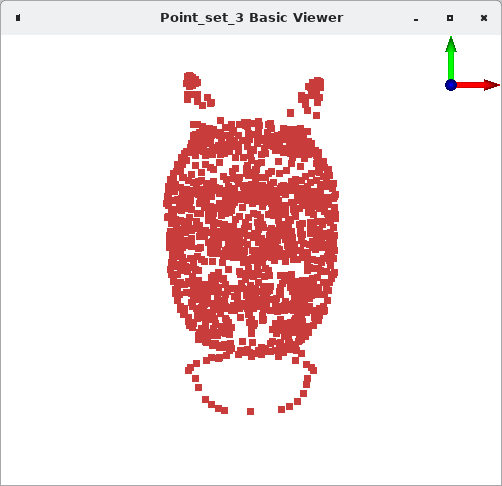
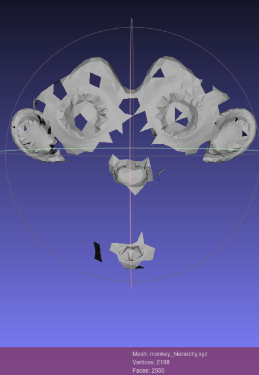

# Reconstruction de maillage 3D

Bedouret Baptiste
Wolff Tony

## Exercice 1 : Importation et visualisation

Voici la visualtion en nuage de points du fichier CQ500-CT-0.xyz :




Avec blender, nous pouvons visualiser les modèles suivants :


## Exercice 2 : simplification
#### Grid simplification

La méthode ```grid_simply_point_set``` fonctionne sur les petits nuages de points AVEC une taille de cellules servant à clusterizer de 0.03. Par exemple sur *oni.xyz* nous avons une nette réduction du nombre de points à vu d'oeil, alors qu'avec
*CQ500-CT-0.xyz* aucune réduction n'est visible. Il a fallu augmenter ```cell_size`` dans notre code pour visualiser la simplificaiton. A noter que cette simplification ne garde pas la forme géométrique originale sur *oni.xyz*.

**Simplification de CQ500**


**Simplification d'oni**


Avec la méthode ```hierarchy_simplify_point_set```, nous avons essayé sur **oni.xyz**, la méthode réduit parfaitement le nuage de points en une forme lisible pour nous sans toucher aux paramètres par défaut. Alors que pour **CQ500** n'a pas l'air d'être modifié, pourtant il y a bien une réduction de points effectués comme on peut le voir sur cette capture d'écran.
De plus, nous avons essayé sur un maillage présent dans blender, le singe contient énormément de vertex/sommets/points mais celui-ci est bien réduit en une forme lisible sans perte de géométrie flagrante.

**Réduction de points visible sur CQ500**


**Oni simplifié avec hierarchy**


**Singe original**


**Singe simplifié avec Hierarchy**


## Exercice 3 : Reconstruction

### Avec Poisson

Voici notre première reconstruction avec le code CGAL pour poisson. Le maillage ne présente aucun trous et est facilement reconnaissable.


La reconstruction poisson, après simplification avec l'algo hierarchy donne un piètre résultat, la forme générale est indistinguable. Il n'y a pas d'artefacts, mais on peut noter l'apparition d'arêtes saillantes puisque les faces sont assez grosses.


Poisson nous donne une aussi bonne reconstruction pour le maillage détaillé du singe. On peut voir qu'il y a des artefacts au niveau de la bouche, et des oreilles.


BPA donne de meilleurs résultats que poisson sur ce mesh. Il n'y a aucun trous, le maillage est lisse, et il y a quelques problèmes aux alentours des yeux, du nez, des oreilles, et la bouche, sans doute dû à un amas d'arêtes sur ces endroits où la profondeur change.

### Avec BPA


Le singe simplifié avec hierarchy résulte en une silhouette délabrée de ce qu'on distingue être  un singe, mais la  simplification perd trop d'informations.



A l'aide de BPA via meshlab, nous avons essayé la reconstruction des faces du maillage CQ500-CT. Voici ce que nous obtenons : en photo ce n'est pas très lisible mais la navigation 3D l'est un peu plus. On voit des trous et quelques artéfacts avec des faces non connectées. Le maillage a été simplifiée deux fois avec hierarchy.


Via BPA, le maillage oni (sans simplification) donne quelque chose de mieux construit et mieux ordonné, mais encore avec beaucoup de trous.

